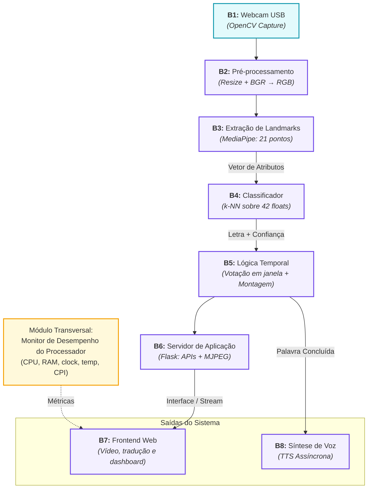

# Tradutor Embarcado de LIBRAS

**PCS3732 — Laboratório de Processadores**
Escola Politécnica da Universidade de São Paulo — Departamento de Engenharia
de Computação e Sistemas Digitais (PCS)

|                           |                                                                      |
| ------------------------- | -------------------------------------------------------------------- |
| **Grupo**                 | Enzo Koichi Jojima (14568285) e Pedro Biagioni Matusita (14602115)   |
| **Professores**           | Prof. Dr. Victor Takashi Hayashi e Prof. Dr. Carlos Eduardo Cugnasca |
| **Plataforma-alvo**       | Raspberry Pi 4                                                       |
| **Release desta entrega** | `v1.0` — documentação inicial (motivação, requisitos, arquitetura) |

---

## Sumário

1. [Motivação](#1-motivação)
2. [Especificação de requisitos](#2-especificação-de-requisitos)
3. [Arquitetura proposta](#3-arquitetura-proposta)
4. [Instrumentação e avaliação de desempenho](#4-instrumentação-e-avaliação-de-desempenho)
5. [Plano de trabalho e entregas](#5-plano-de-trabalho-e-entregas)

> **Sobre este documento.** Ele consolida e **refina** a motivação, a
> especificação de requisitos e a arquitetura proposta apresentadas nos
> relatórios anteriores do grupo. Os refinamentos introduzidos nesta versão
> estão marcados com o rótulo **[refinado]** ao longo do texto.

---

## 1. Motivação

### 1.1 Contexto e problema

Segundo o IBGE (Censo 2022), cerca de **2,3 milhões de brasileiros** declaram
ter deficiência auditiva com grau severo de dificuldade. A Língua Brasileira
de Sinais (LIBRAS) é reconhecida como meio legal de comunicação e expressão
pela **Lei nº 10.436/2002** e regulamentada pelo **Decreto nº 5.626/2005** —
mas a esmagadora maioria da população ouvinte não a domina.

O resultado prático é uma **assimetria de comunicação**: em um balcão de
atendimento, numa recepção de hospital, numa secretaria de escola, a pessoa
surda se expressa em uma língua que o interlocutor não entende, e a mediação
depende de um intérprete humano — recurso escasso, caro e indisponível na
maior parte das interações cotidianas.

### 1.2 Por que um dispositivo embarcado

Um tradutor útil nesse cenário precisa satisfazer restrições que empurram a
solução para a borda (_edge computing_), e não para a nuvem:

| Restrição | Consequência de projeto |
| :----- | :---------------------- |
| **Latência**        | A conversa é sincrônica. Ida e volta de vídeo para um servidor insere atraso e jitter incompatíveis com diálogo natural. O processamento deve ser local. |
| **Disponibilidade** | Balcões, escolas e postos de saúde não têm conectividade garantida. O dispositivo deve funcionar **100% offline**.                                       |
| **Privacidade**     | O dado de entrada é o vídeo do rosto e das mãos do usuário — dado sensível (LGPD). Não transmiti-lo elimina a classe inteira de riscos de vazamento.     |
| **Custo**           | Para escalar em serviço público, o hardware precisa ser barato: um SBC de dezenas de dólares, não uma GPU.                                               |

Essas quatro restrições definem o problema central de engenharia do projeto e
o que o torna interessante para **Laboratório de Processadores**: fazer um
pipeline de visão computacional em tempo real caber no orçamento de ciclos de
um Cortex-A72 sem acelerador dedicado.

### 1.3 Objetivos

**Objetivo geral** — construir um dispositivo embarcado autônomo que capture
gestos manuais por webcam, reconheça letras do alfabeto em LIBRAS e apresente
a tradução simultaneamente como **texto** (tela) e **voz** (áudio), com todo o
processamento executado localmente.

**Objetivos específicos**

1. Implementar o pipeline de reconhecimento (captura → pré-processamento →
   extração de landmarks → classificação → estabilização temporal → saída) em
   módulos independentes e testáveis.
2. Atingir taxa de quadros e latência compatíveis com uso interativo na
   Raspberry Pi (metas quantificadas em [RNF-02](#22-requisitos-não-funcionais)).
3. **[refinado]** Instrumentar o sistema para medir o comportamento do
   **Pi** e da **aplicação** sob a carga real do projeto, taxa de clock,
   temperatura, _thermal throttling_, RAM, FPS.
4. Garantir que cada requisito levantado seja verificável por teste
   automatizado, executável sem o hardware-alvo.

---

## 2. Especificação de requisitos

**Escopo do sistema.** Reconhecimento das **letras estáticas** do alfabeto em
LIBRAS, uma mão, gesticuladas em frente a uma webcam, com montagem das letras
confirmadas em palavras.

**Fora de escopo (nesta iteração).** Sinais que envolvem movimento (H, J, K,
X, Y, Z e a maioria das palavras da língua), sinais bimanuais, expressões
faciais como marcador gramatical, e tradução no sentido inverso (voz → sinais).

**Atores.** _Usuário sinalizante_ (pessoa que se comunica por LIBRAS) e
_usuário ouvinte_ (lê a tela e ouve o áudio). O dispositivo é o mediador.

**Premissas.** Iluminação ambiente razoável; mão enquadrada e preenchendo
parte significativa do quadro; fundo arbitrário (a etapa de landmarks torna o
sistema pouco sensível ao fundo).

### 2.1 Requisitos funcionais

_Prioridade: E = essencial, D = desejável._

| ID | Requisito | Descrição | Pri. | Critério de aceitação |
|:---|:----------|:----------|:----:|:----------------------|
| **RF-01** | Interface de visualização                                    | O sistema apresenta em tela a letra corrente, a palavra em formação, o histórico de palavras e o painel de desempenho.                        | E    | A página e todas as APIs que a alimentam respondem sem falha; os campos refletem o estado do pipeline.                                                      |
| **RF-02** | Captura por webcam                                           | O sistema recebe quadros de uma webcam USB, processa-os e disponibiliza o quadro tratado para exibição.                                       | E    | O caminho completo recepção → processamento → quadro exibível é percorrido; índice de câmera inválido produz erro tratado, não travamento.                  |
| **RF-03** | Reconhecimento de sinais                                     | Dado um gesto estável de uma letra do alfabeto, o sistema identifica a letra com um grau de confiança associado.                              | E    | Apresentado o alfabeto inteiro quadro a quadro (com ruído), as letras são confirmadas na ordem esperada.                                                    |
| **RF-04** | Estabilização temporal e montagem de palavras **[refinado]** | Uma letra só é confirmada com confiança mínima e domínio da janela de votação; letras confirmadas formam palavras, fechadas por pausa da mão. | E    | Transições entre gestos não geram letras espúrias; letra repetida exige liberação (mão fora do quadro); pausa longa fecha a palavra.                        |
| **RF-05** | Saída em voz **[refinado]**                                  | Cada palavra concluída é sintetizada em áudio pelo dispositivo.                                                                               | E    | Partindo somente de gestos, o sistema produz as duas saídas (texto e fala); ausência de motor de voz degrada para somente texto, sem falhar.                |
| **RF-06** | Construção do dataset de gestos **[refinado]**               | O sistema oferece meios de alimentar o classificador: coleta ao vivo por webcam e importação de bancos públicos de imagens do alfabeto.       | E    | Amostras coletadas/importadas são persistidas no dataset e passam a ser reconhecidas pelo classificador.                                                    |
| **RF-07** | Painel de desempenho do processador **[refinado]**           | O sistema expõe em tela, atualizadas periodicamente, as métricas do processador sob a carga corrente.                                         | E    | O painel apresenta uso de CPU, memória, clock, temperatura, FPS e latência por estágio; métrica sem fonte na plataforma aparece como indisponível. |
| **RF-08** | Modo demonstração                                            | O sistema executa o pipeline completo com gestos sintéticos, sem câmera e sem biblioteca de visão.                                            | D    | Um texto configurável é soletrado ponta a ponta, exercitando classificação, votação, montagem de palavras, painel e voz.                                    |

### 2.2 Requisitos não funcionais

| ID | Requisito | Descrição / meta | Verificação  |
|:---| :-------- | :--------------- | :----------- |
| **RNF-01** | Acessibilidade | A comunicação de entrada se dá **exclusivamente por sinais** (sem teclado ou toque) e a saída é dupla: visual e sonora, para atender interlocutor ouvinte. | Teste que estimula o sistema só com gestos e observa as duas saídas. |
| **RNF-02** | Desempenho em tempo real **[refinado — metas antes ausentes]** | Metas na plataforma-alvo: **≥ 10 quadros/s** efetivos de pipeline; **latência de confirmação de letra ≤ 500 ms** após o gesto estabilizar; ocupação de CPU compatível com execução contínua sem _throttling_ permanente. | Medição pelo painel e pelo benchmark na Pi; comparação com a máquina de referência. |
| **RNF-03** | Observabilidade do processador **[refinado]** | O sistema mede e expõe taxa de clock, temperatura, uso de memória, FPS, latências e fornece testes com cargas padronizadas. | Painel em tempo real; execução de testes unitários para validação e retrocompatibilidade. |
| **RNF-04** | Portabilidade | Funciona **offline**; nenhuma etapa depende de serviço externo; consumo de memória estável em execução prolongada. | Teste que bloqueia sockets e roda o pipeline completo; verificação de estabilidade de memória. |
| **RNF-05** | Privacidade **[refinado — explicitado]** | Nenhum quadro de vídeo, landmark ou texto traduzido deixa o dispositivo. Não há telemetria nem armazenamento de vídeo. | Mesmo teste de isolamento de rede do RNF-04; inspeção do código quanto a chamadas de saída. |
| **RNF-06** | Robustez e degradação graciosa **[refinado]** | Falhas transitórias de leitura da câmera não derrubam o sistema; ausência de componente opcional (motor de voz, contadores de desempenho, sensor de temperatura, biblioteca de visão) reduz funcionalidade sem interromper a execução. | Testes de falha injetada e de plataforma sem os componentes opcionais / testes unitários e de integração.                               |
| **RNF-07** | Testabilidade sem hardware | A suíte de testes roda em qualquer máquina, substituindo apenas os estágios de hardware por implementações sintéticas determinísticas. | Suíte completa executada em ambiente sem câmera. |

### 2.3 Rastreabilidade requisito → verificação

Cada requisito da tabela acima corresponde a um conjunto de testes
automatizados dedicado, que implementa o cenário de teste ali descrito. A
suíte é executada por um único comando e serve de critério objetivo de
conclusão de cada requisito: um requisito só é considerado atendido quando o
teste correspondente passa.

Além disso, a suite sem hardware pode ser utilizada como teste automatizado em ferramentas de CI/CD como Github Actions.

---

## 3. Arquitetura proposta

### 3.1 Estilo arquitetural

O software adota o estilo **dutos e filtros** (_pipes and filters_): cada
quadro de vídeo atravessa uma sequência de estágios, e cada estágio é um
módulo com responsabilidade única e contrato explícito de entrada/saída.

Três consequências justificam a escolha:

1. **Substituibilidade** — cada estágio de hardware tem uma implementação real
   e uma sintética que satisfazem o mesmo contrato. É isso que viabiliza o modo
   demonstração (RF-08) e os testes sem hardware (RNF-07).
2. **Medição por estágio** — a fronteira entre filtros é o ponto natural de
   instrumentação: a latência é medida estágio a estágio, o que localiza o
   gargalo em vez de apenas indicá-lo (RF-07).
3. **Evolução isolada** — trocar o classificador ou o extrator de landmarks não
   afeta os demais blocos.

### 3.2 Diagrama de blocos

### 3.3 Arquitetura de hardware

| Componente | Papel | Observações |
| :---- | :----- |:------ |
| **Raspberry Pi 4** (BCM2711, 4× Cortex-A72 @ 1,5–1,8 GHz, ARMv8-A, 64 bits) | Unidade de processamento — executa todo o pipeline. | Sem acelerador de inferência dedicado: **o orçamento de ciclos é a restrição de projeto central**. O Cortex-A72 do Pi também não possui a extensão criptográfica ARMv8 (AES), o que restringe as versões de bibliotecas com binários pré-compilados utilizáveis. |
| **Webcam USB** | Sensor de entrada (vídeo). | 640×480 é suficiente; a redução da largura de processamento ocorre em B2. |
| **Monitor via HDMI** | Saída visual (RF-01). | Exibe o frontend em tela cheia. |
| **Alto-falante / fone (P2 ou USB)** | Saída sonora (RF-05). |  |
| **Cartão microSD + fonte USB-C** | Armazenamento e alimentação. | Raspberry Pi OS 64 bits (`aarch64`). |

Toda a operação é local: não há enlace de rede necessário em tempo de execução
(RNF-04, RNF-05).

### 3.4 Fluxo de dados

Ao longo do pipeline, a representação do gesto vai ficando progressivamente mais abstrata e mais compacta — é essa redução de dimensionalidade que torna o projeto viável na plataforma-alvo.

```mermaid
graph LR
    %% Estilos dos nós
    classDef dado fill:#f8f9fa,stroke:#343a40,stroke-width:1px;
    classDef processo fill:#e7f5ff,stroke:#228be6,stroke-width:2px;

    %% Elementos do Fluxo
    Q1["Quadro Capturado<br><b>(Matriz Bruta USB)</b>"]:::dado
    B2((B2: Pré-processamento)):::processo
    Q2["Quadro Pré-processado<br><b>(Dimensões Reduzidas)</b>"]:::dado
    B3((B3: Extração)):::processo
    L3["Landmarks da Mão<br><b>(21 pontos XYZ)</b>"]:::dado
    B31((B3.1: Vetorização)):::processo
    V4["Vetor de Atributos<br><b>(42 floats relativos)</b>"]:::dado
    B4((B4: Classificador k-NN)):::processo
    LC["Letra + Confiança<br><b>(Predição Instantânea)</b>"]:::dado
    B5((B5: Lógica Temporal)):::processo
    LF["Letra Confirmada / Palavra<br><b>(Saída Estabilizada)</b>"]:::dado

    %% Conexões
    Q1 --> B2
    B2 --> Q2
    Q2 --> B3
    B3 --> L3
    L3 --> B31
    B31 --> V4
    V4 --> B4
    B4 --> LC
    LC --> B5
    B5 --> LF
```

Depois de B3, o problema deixa de ser de visão computacional e passa a ser de classificação geométrica de baixa dimensionalidade — barata o suficiente para caber no tempo restante do orçamento de ciclos por quadro do processador.

### 3.5 Decisões arquiteturais e alternativas consideradas

| #   | Decisão                                          | Alternativas                          | Justificativa                                                                                                                                       |
| --- | ------------------------------------------------ | -------------------------------------- | ---------------------------------------------------------------------------------------------------------------------------------------------------- |
| 1   | Processamento **na borda**, sem nuvem            | Inferência em servidor remoto         | Latência, disponibilidade offline, privacidade do vídeo e custo (Seção 1.2).                                                                        |
| 2   | Classificar **landmarks**, não pixels            | CNN sobre a imagem do gesto           | Reduz drasticamente a dimensionalidade da entrada e torna o reconhecimento pouco sensível a fundo e iluminação; viabiliza um classificador trivial. |
| 3   | **k-NN** como classificador                      | Rede neural, SVM, _random forest_     | Custo de inferência mínimo no ARM; treino instantâneo e incremental com amostras do próprio usuário; sem etapa de treino offline.                   |
| 4   | **Estabilização temporal** por votação em janela | Aceitar a predição do quadro corrente | Elimina letras espúrias em transições de gesto — maior ganho de qualidade percebida.                                                                |

### 3.6 Testabilidade e modo demonstração

Cada estágio dependente de hardware possui, além da implementação real, uma
implementação sintética determinística que satisfaz o mesmo contrato. Isso
produz dois benefícios diretos:

- **Modo demonstração (RF-08)** — soletra um texto configurável percorrendo o
  pipeline **real** de classificação, votação, montagem de palavras, painel e
  voz, em qualquer computador, sem câmera nem biblioteca de visão.
- **Suíte de requisitos (RNF-07)** — os testes substituem _apenas_ os estágios
  de hardware; todos os demais estágios exercitados são os de produção.

---

## 4. Instrumentação e avaliação de desempenho

### 4.1 Painel em tempo real (RF-07)

| Métrica                    | Fonte                                                                    |
| -------------------------- | ------------------------------------------------------------------------ |
| Uso de CPU e de memória    | contadores do sistema operacional                                        |
| Taxa de clock (MHz)        | contadores do sistema operacional, com alternativa via utilitário do SoC |
| Temperatura (°C)           | sensor térmico exposto pelo sistema operacional ou utilitário do SoC     |
| FPS e latência por estágio | medidos pelo próprio pipeline                                            |

Métrica sem fonte disponível na plataforma é reportada como indisponível — o
sistema nunca falha por ausência de sensor (RNF-06).

### 4.2 Benchmark comparável entre hardwares (RNF-02, RNF-03)

O painel mede o sistema em operação; o benchmark (`python -m libras.benchmark`)
mede o **processador** sob cargas padronizadas, para que a mesma aplicação
possa ser comparada entre a máquina de desenvolvimento e a plataforma-alvo.

| Carga               | O que isola                                    | Métrica |
| ------------------- | ---------------------------------------------- | ------- |
| `inteiro_python`    | ALU escalar de um núcleo (sensível a clock)    | MOPS    |
| `flutuante_matmul`  | Ponto flutuante vetorizado (numpy/BLAS)        | GFLOPS  |
| `memoria_copia`     | Largura de banda de memória                    | GB/s    |
| `pipeline_traducao` | O pipeline real do projeto, em modo sintético  | FPS     |

São quatro cargas, e não uma pontuação única, porque o interesse não é saber
*quanto* a Pi é mais lenta, e sim **onde** ela é mais lenta. A pontuação
composta é a média geométrica das razões contra a máquina de referência
(1000 = referência), e serve apenas de resumo. CPI e IPC são medidos sob carga
com `perf stat`; clock e temperatura são registrados antes e depois das
cargas, o que evidencia _thermal throttling_.

**Limitação conhecida.** A carga `pipeline_traducao` usa o dataset sintético
(208 amostras) para ser reprodutível em qualquer máquina; o dataset de
produção tem ~13 mil. Como o custo do k-NN é linear no número de amostras, a
carga subestima a classificação — e a subestima mais na Pi, onde a varredura
de memória pesa mais. A comparação entre hardwares deve levar isso em conta.

### 4.3 Otimizações de desempenho na plataforma-alvo

A primeira execução na Raspberry Pi apresentou taxa de quadros baixa e atraso
perceptível entre o gesto e a tradução. A investigação separou três causas
independentes, e o registro delas interessa mais que o resultado: duas não
estavam no código.

**1. Latência de fila na captura (B1).** A câmera entrega 30 quadros/s, e o
pipeline sustenta cerca de 8: o excedente ficava na fila do driver V4L2, e o
quadro que chegava à inferência já estava velho. O sistema traduzia um gesto
do passado. A correção é a leitura da câmera em thread própria
(`ThreadedFrameSource`), entregando sempre o quadro mais recente e
descartando os atrasados. Medido com a fila do driver emulada e 80 ms de
inferência por quadro:

| Configuração          | FPS do pipeline | Atraso do quadro processado |
| --------------------- | --------------- | --------------------------- |
| Leitura no laço       | 12,3            | 26,4 quadros (~878 ms)      |
| Leitura em thread     | 12,3            | 0,0 quadros                 |

A taxa de quadros **não muda** — a inferência custa o mesmo. O que a
otimização elimina é latência, e o painel passou a expor
`quadros_descartados` como medida direta da distância entre a taxa da câmera
e a do pipeline.

**2. Janela temporal calibrada para a plataforma errada (B5).** Os parâmetros
de votação foram dimensionados em quadros para 30 fps: `min_votes = 8` a 30
fps são 267 ms, mas a 8 fps são **1000 ms** — acima da meta de 500 ms do
RNF-02. O atraso vinha da configuração, não da lentidão do processador. As
janelas passaram a ser declaradas em **segundos** (`vote_window_s`,
`release_s`, `word_pause_s`) e convertidas para quadros pela taxa medida na
partida (`measure_fps` → `Config.tuned_for_fps`):

| Taxa sustentada | Janela      | Votos | Latência por letra |
| --------------- | ----------- | ----- | ------------------ |
| 30 fps          | 12 quadros  | 8     | 267 ms             |
| 12 fps          | 5 quadros   | 3     | 250 ms             |
| 8 fps           | 3 quadros   | 2     | 250 ms             |

A 30 fps a conversão reproduz exatamente os valores anteriores, o que a suíte
verifica. O contrapeso é explícito: menos votos por letra significa menos
filtragem contra letra espúria, e a troca agora é ajustável em dois
parâmetros (`vote_window_s`, `min_vote_ratio`) em vez de escondida em
contagens de quadros.

**3. Timestamp irreal no rastreador (B3).** O extrator informava ao MediaPipe
incrementos fixos de 33 ms por quadro, isto é, afirmava rodar a 30 fps. O modo
VIDEO usa esse intervalo no modelo de movimento do rastreador: a 8 fps reais,
o rastreador esperava a mão quase parada, errava a previsão e recaía na
detecção de palma completa — o caminho caro — na plataforma que menos pode
pagá-lo. Passou a informar o tempo real decorrido, monotônico e estritamente
crescente.

**Custos periféricos eliminados.** O fluxo MJPEG reencodava o mesmo quadro
quando o pipeline era mais lento que a taxa do fluxo (~20–30% dos encodes); a
medição de CPI abria um processo `perf stat` a cada 5 s (agora 30 s); e o
frontend consultava o estado a 4 Hz para um valor que muda a ~8 Hz (agora
2 Hz).

**Limitação.** A calibragem da janela temporal ocorre na partida. Se a taxa
sustentada cair depois — por aquecimento e redução de clock — a janela
permanece dimensionada para a taxa antiga e a latência por letra cresce
silenciosamente. Recalibragem periódica é a correção; o efeito é justamente o
que a análise térmica da Entrega 5 deve medir.

---

## 5. Plano de trabalho e entregas

| Entrega                                       | Objetivo                                                                                                                   |
| --------------------------------------------- | -------------------------------------------------------------------------------------------------------------------------- |
| **1 — Documentação inicial** _(esta entrega)_ | Repositório público criado e organizado; motivação, requisitos e arquitetura refinados a partir dos relatórios anteriores. |
| **2 — Migração do núcleo do pipeline**        | Trazer os blocos B1–B5 e a suíte de testes de requisitos, com a suíte passando no repositório novo. |
| **3 — Interface e saídas**                    | Trazer B6, B7 e B8; tradução visível em tela e audível. |
| **4 — Instrumentação e medição**              | Instrumentação, medição e painel de desempenho. |
| **5 — Execução no alvo e avaliação**          | Rodar na Raspberry Pi, levantar a comparação de desempenho e analisar CPI, clock e efeito térmico. |
| **6 — Relatório final**                       | Consolidar resultados, limitações e conclusões, com vídeo de demonstração. |

_O escopo de cada entrega posterior será ajustado às orientações do professor à
medida que forem publicadas._

### 5.1 Versionamento e _releases_

- **Ramo principal:** `main`.
- **_Commits_:** convenção _Conventional Commits_ (`feat:`, `fix:`, `docs:`…).
- **_Releases_:** uma _tag_ por entrega, no formato `v<maior>.<menor>`:
  `v1.0` = entrega 1, `v1.1` = entrega 2, `v1.2` = entrega 3, e assim por
  diante até `v1.5` (entrega 6). Cada _tag_ tem nota de _release_ resumindo
  os artefatos e o PDF anexado. Uma correção publicada entre duas entregas
  recebe uma terceira casa (`v1.1.1`).
